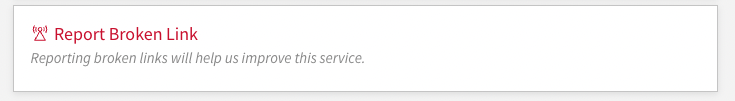
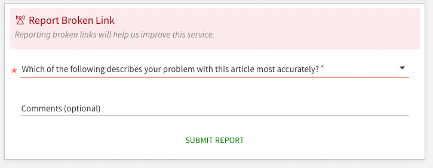
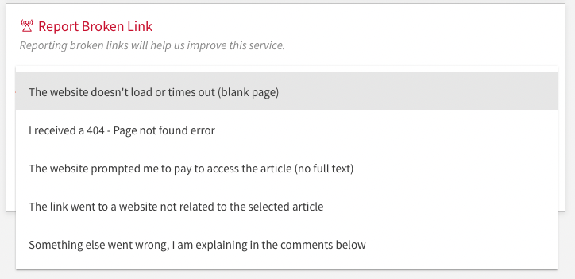

# primove-broken-link-reports-angularjs

AngularJS component for PrimoVE to facilitate one-click reporting of invalid or broken links to electronic resources in Alma's View It section. This implementation does not require the installation of ExLibris' Customization Workflow Development Environment for Primo UI or subsequent build processes. This package might be of interest to users who are unable to install or build Node 10, a current requirement for [primo-explore-devenv](https://github.com/ExLibrisGroup/primo-explore-devenv).

## Installation

Edit the value of submitBrokenLinkReportUrl (https://your.domain.edu/api-endpoint) with your server's api endpoint for additional processing. Add the content of custom.module.js to your view's js/custom.js post initialization:

```js
var app = angular.module("viewCustom", ["angularLoad"]);
```

Archive and upload customization package for your view via Alma Configurations -> Configure Views.

## Screenshots





